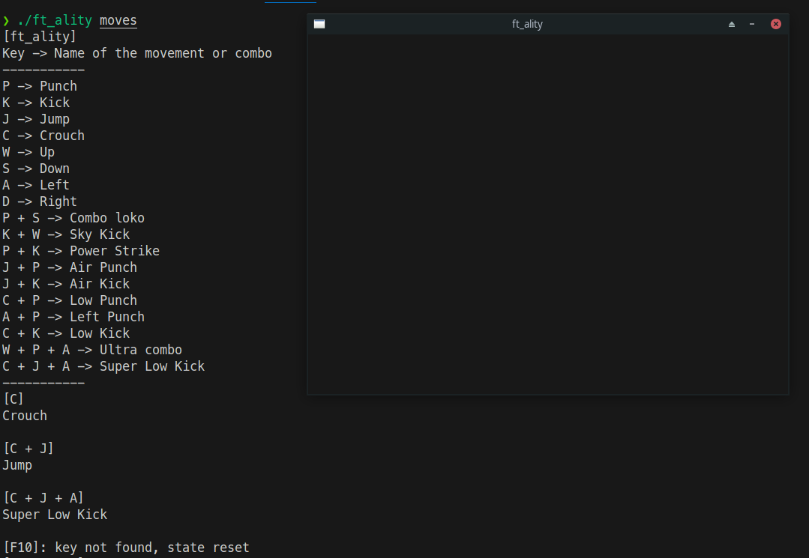

# ft_ality

Training Mode State Machine Simulator



## Overview

This application is a state machine simulator designed to emulate the training mode of a video game, focusing on handling key combinations. The simulator features a simple interface with a black window to capture keyboard events and utilizes the terminal to print the current state and description of each state. The states and their transitions are defined in an external, customizable "grammar" file.

## Features

### Key Features

1.  **Keyboard Event Handling**: Captures and processes keyboard events to update the state of the machine.
2.  **State Management**: Maintains and updates the current state based on key combinations.
3.  **Customizable Grammar File**: Allows users to define and customize states and transitions through an external "grammar" file.
4.  **Real-time Feedback**: Prints the current state and corresponding descriptions to the terminal in real-time.
5.  **Error Handling**: Provides feedback for invalid key combinations and resets the state accordingly.
6.  **Simple User Interface**: Utilizes an SDL-based black window for capturing keyboard events.

### Detailed Description

1.  **Initialization**:
    
    -   The application initializes SDL for handling window events.
    -   Loads the grammar from a user-specified file, which defines the states and their transitions.
    -   Validates and prints the grammar to ensure correctness.
2.  **Event Loop**:
    
    -   Continuously listens for keyboard events.
    -   Updates the current state based on the key pressed and the predefined grammar.
    -   If a valid key combination is detected, prints the current state and its description.
    -   Resets the state if an invalid key combination is encountered.
    -   Exits gracefully when a quit event (e.g., pressing the Escape key) is received.
3.  **State Update Logic**:
    
    -   The `update_state` function checks if the current key combination exists in the grammar.
    -   If the combination is valid, updates the state accordingly.
    -   If the combination is invalid, resets the state and provides feedback.
4.  **Event Handling**:
    
    -   The `handle_event` function processes different types of SDL events.
    -   For key down events, it updates the state and prints the relevant description or error message.
    -   Manages the event loop continuation based on user input and event types.
5.  **Custom Grammar File**:
    
    -   Users can define states, transitions, and descriptions in a separate grammar file.
    -   The grammar file is parsed and validated at the start of the application.
 


## How to Use

1.  **Setup**:
    -   Ensure SDL is installed on your system.
    -   Clone the repository and navigate to the project directory.
    -   Create a grammar file defining the states and transitions or use the provided one.
2.  **Running the Application** 
	a. Option  1:
	- Compile the Ocaml code with `make`
	- Execute the application with the grammar file as an argument. `./ft_ality grammars/albgarci_kombat.gmr`
	- Interact with the application by pressing keys and observing the terminal output.
	
	b. Option 2:
    -   Compile the Ocaml code with `dune build`
    -   Execute the application with the grammar file as an argument. `dune exec bin/main.exe grammars/albgarci_kombat.gmr`
    -   Interact with the application by pressing keys and observing the terminal output.
    
3.  **Customizing the Grammar**:
    
    -   Edit the grammar file to define new states and transitions.
    -   Follow the syntax and structure provided in the sample grammar file.
    -   Reload the application to apply changes.


 ### Example of grammar file:
 
    ```
    P = Punch
    K = Kick
    J = Jump
    C = Crouch
    W = Up
    S = Down
    A = Left
    D = Right
    P+S = Combo loko
    K+W = Sky Kick
    P+K = Power Strike
    J+P = Air Punch
    J+K = Air Kick
    C+P = Low Punch
    A+P = Left Punch
    C+K = Low Kick
    W+P+A = Ultra combo
    C+J+A = Super Low Kick
    ```
## Dependencies

- Ocaml
- ocamlc 
- ocamlfind
- ocaml tsdl package: https://ocaml.org/p/tsdl/latest/doc/index.html
- SDL2 https://www.libsdl.org/
- Dune (optional) https://github.com/ocaml/dune